## 1.SpringBoot 简介

什么是springboot？spring公司提供的，用来开发JavaEE的框架

为何用springboot？（spring已经很优秀了，为何需要springboot呢？因为spring项目写代码很爽，但是有麻烦的地方，第一是需要配置的maven依赖太多，第二是依赖的jar包版本总是冲突，第三是运行使用的配置文件太多，添加一个框架或者技术，就多一个配置文件，用springboot会弥补这些不足）

通过如下的三个调料包（外加一个内置的tomcat）：

1，版本锁定：集合了常用依赖的版本，版本不再冲突

2，起步依赖：一个starter就集合了开发需要的多个maven依赖，不用再去搜需要哪些依赖了

3，自动配置：集合了常用的技术的配置信息，约定大于配置（比如tomcat端口就是8080，session的过期时间就是半小时），无需配置不必要的配置

4，内置了tomcat：通过内置的tomcat，无需再用其他外界的tomcat就可以运行程序；

**总之：使用springboot可以快速地开发spring项目**

## 2.SpringBoot 快速开发

需求：浏览器访问localhost:8080/hello, 返回hello, springboot! 这句话

#### 2.1.自动创建springboot项目

[^pic 01]: 

需求，在浏览器输入hello，项目可以返回 hello,spring boot!（web开发呗）

步骤如下：

1.idea创建一个项目，选择spring initializr

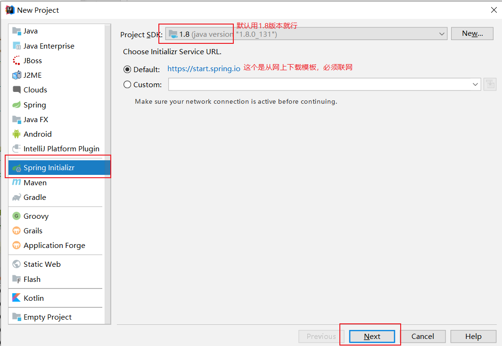

2. 填写项目的坐标 Group 和 Artifact

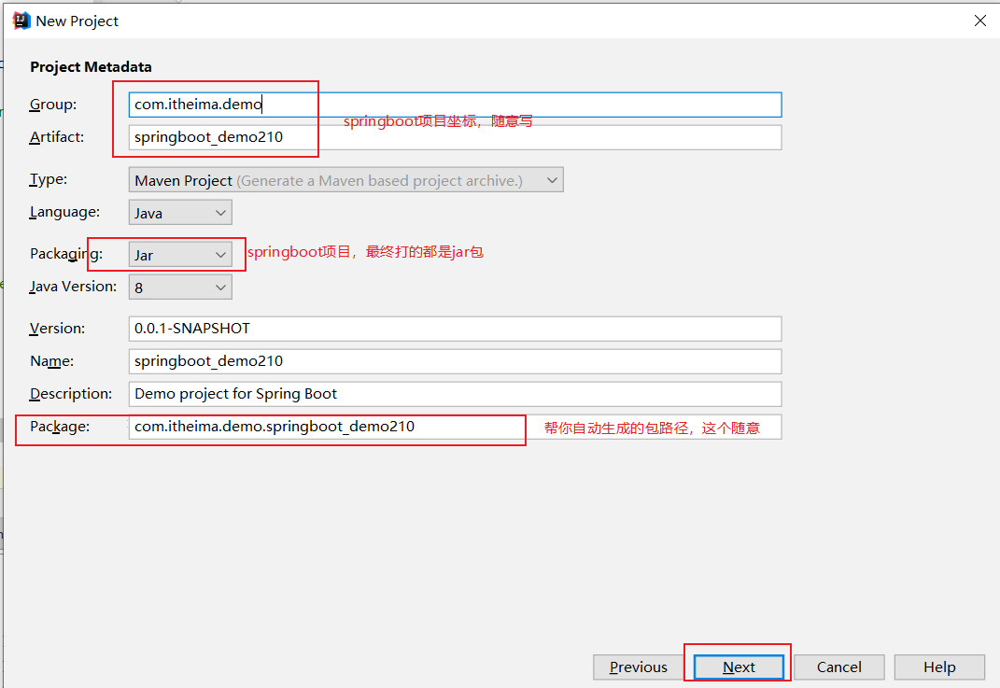

3. 既然返给浏览器信息，那么就是开发web项目，把Spring Web 点上

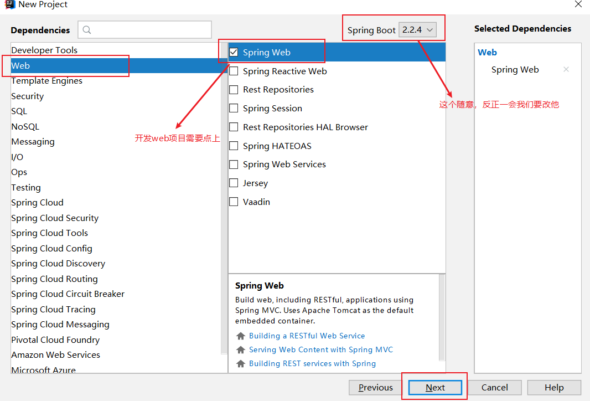

4. 项目名称，可改可不改

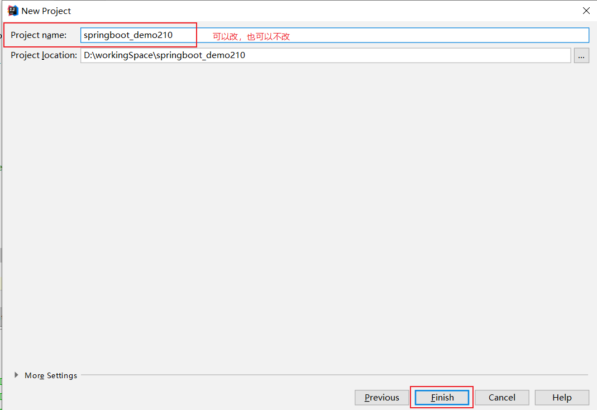

5. 直接创建controller

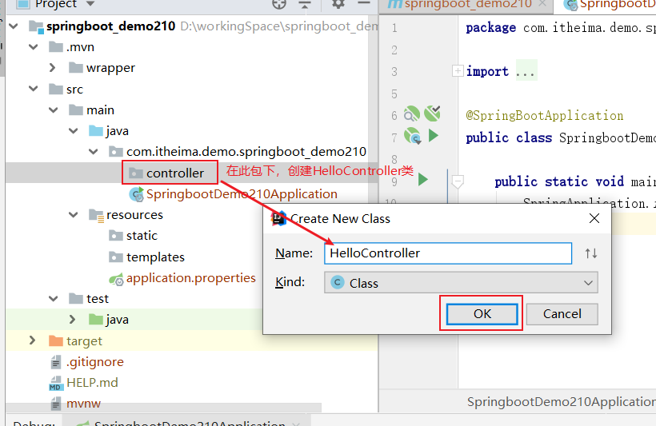

6. 编辑@RestController，controller中每个方法都返回Json字符串，创建一个方法，给个映射地址

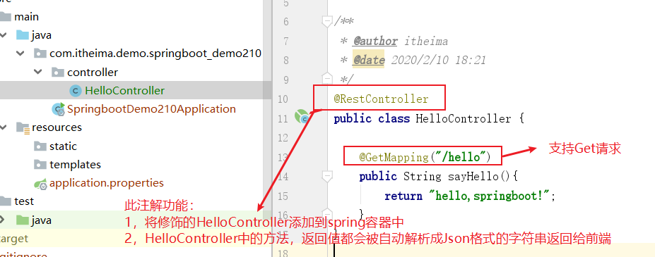

7. 找到如图中的类（启动类）, 然后点击执行main方法

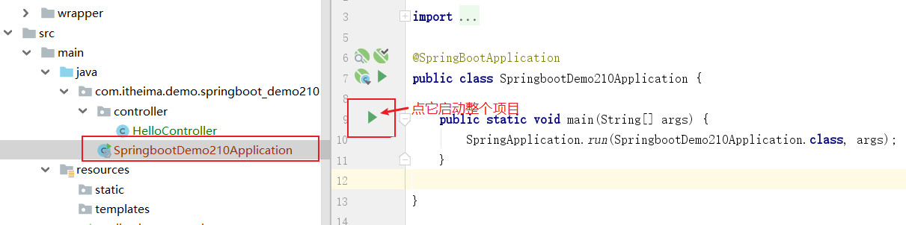

8.启动之后查看控制台：

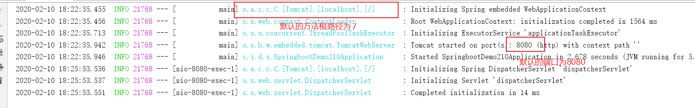

9.在浏览器输入：http://localhost:8080/hello，返回信息，完成web的开发......

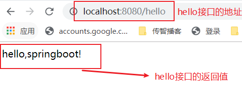

#### 2.2.依赖太多记不住？起步依赖原理分析

因为引了spring-boot-starter-web，所以背后有一堆和web相关的依赖jar包

~~~yml
	<dependency>
        <groupId>org.springframework.boot</groupId>
        <artifactId>spring-boot-starter-web</artifactId>
    </dependency>
~~~

背后的jar包，帮你都引了：

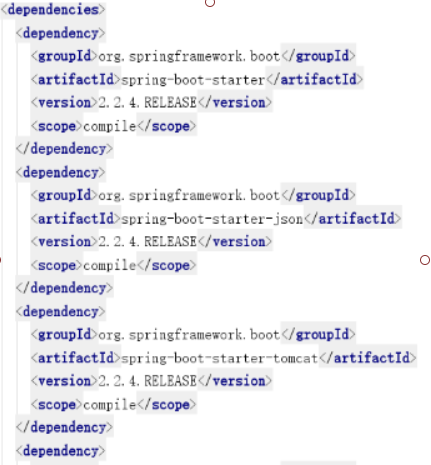

#### 2.3.版本太多容易冲突？版本锁定原理分析

因为继承了spring-boot-starter-parent,所以背后有一堆已经指定好的版本号，所以唯一需要动的版本就是parent的版本，习惯用2.1.7.RELEASE版本，这个2.1.7.RELEASE版本号要是换了，背后的一堆已经指定的依赖的版本就有可能跟着换一批；

~~~yml
    <parent>
        <groupId>org.springframework.boot</groupId>
        <artifactId>spring-boot-starter-parent</artifactId>
        <version>2.1.7.RELEASE</version>
        <relativePath/> <!-- lookup parent from repository -->
    </parent>
~~~

背后集合的版本：

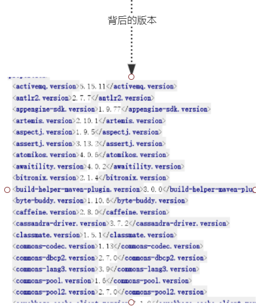

#### 2.4.配置太多容易错？自动配置原理分析

springboot是基于约定的，大家约定好的，都这么用，所以很多配置都有默认值；

比如说：tomcat 端口 8080，一提到tomcat默认端口，立刻想到的就是8080

在如下的依赖中，有N多的默认的配置信息，这个spring-boot-starter依赖，在web起步依赖或者test起步依赖中都有；

~~~yml
   <dependency>
      <groupId>org.springframework.boot</groupId>
      <artifactId>spring-boot-starter</artifactId>
      <version>2.1.7.RELEASE</version>
      <scope>compile</scope>
    </dependency>
~~~

背后自动帮你配置的信息：

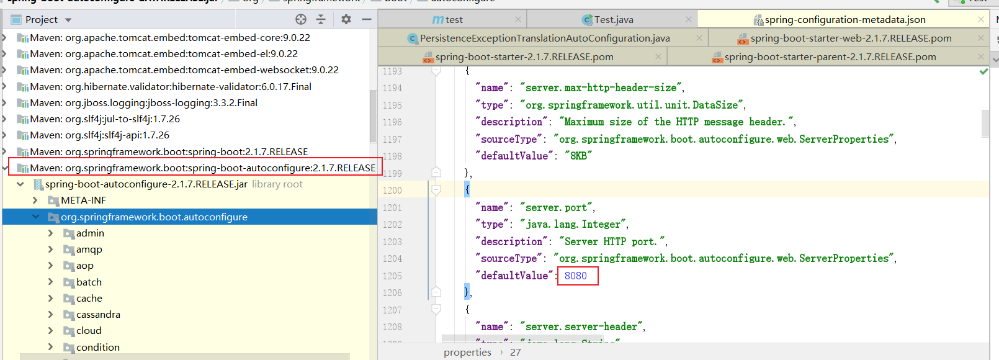

再比如：session 的过期默认时间为30m，redis 默认端口6379 等等

## 3.手动创建SpringBoot项目（重点）

（1）编辑pom.yml依赖文件

~~~xml
    <parent>
        <groupId>org.springframework.boot</groupId>
        <artifactId>spring-boot-starter-parent</artifactId>
        <version>2.1.7.RELEASE</version>
    </parent>
    <dependencies>
        <dependency>
            <groupId>org.springframework.boot</groupId>
            <artifactId>spring-boot-starter-web</artifactId>
        </dependency>
    </dependencies>
~~~

（2）编辑引导类

~~~java
@SpringBootApplication
public class DemoApplication {

    public static void main(String[] args) {
        SpringApplication.run(DemoApplication.class, args);
    }
}
~~~

（3）创建Controller类**（注意业务代码的位置：引导类所在的‘同级包‘以及此’同级包‘的子包中）**

~~~java
@RestController
public class HelloController {

    @GetMapping("/hello")
    public String sayHello() {
        return "hello, spring boot 1!";
    }
}
~~~

（4）如何想修改端口号怎么办？？？先看第四章

~~~java

~~~

## 4.自定义配置文件

但是如果想使用自己的配置替换默认配置的话，可以通过在resources下创建文件：

1，application.properties 

2，application.yml

3,   application.yaml

如果多个文件同时存在，每个文件都会被读取，但是如果文件中有重复的配置，优先级高的配置生效（1>2>3）

**推荐使用：application.yml**

#### 4.1.properties 、yml 和 xml 的比较

共同点：都是保存配置信息的

比较：

|          | yml                                        | properties                                 | xml                                                          |
| -------- | ------------------------------------------ | ------------------------------------------ | ------------------------------------------------------------ |
| 案例     | 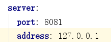 | 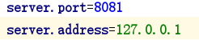 | 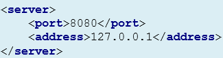 |
| 阅读性   | 非常容易                                   | 还可以                                     | 还可以                                                       |
| 简洁     | 非常简洁                                   | 还可以                                     | 不简洁                                                       |
| 层级关系 | 明显                                       | 没有层级                                   | 明显                                                         |

**总结：推荐使用yml, 以数据为核心**

#### 4.2. yml基本语法

**空格的艺术**

| 语法要求                           | 正确1                                                        | 正确2                                                        | 错误      |
| :--------------------------------- | ------------------------------------------------------------ | ------------------------------------------------------------ | --------- |
| 大小写敏感                         |                                                              |                                                              |           |
| 数据值之前（和冒号之间）必须有空格 | port: 8081                                                   | port:        8081                                            | port:8081 |
| 使用缩进表示层级                   | 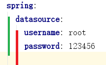 | 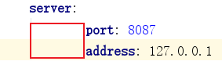 |           |
| #号表示注释                        |                    |                                                              |           |

#### 4.3. yml 数据格式

| 数据                    | 标准写法                                                     |
| ----------------------- | ------------------------------------------------------------ |
| 普通                    |  |
| 对象、Map（key：value） | 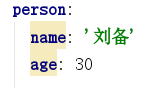 |
| 数组（有次序）          | 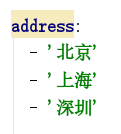 |

## 5.读取配置内容（重点）

|                                            | 使用方法                                                     | 对应的application.yml                                        |
| ------------------------------------------ | ------------------------------------------------------------ | ------------------------------------------------------------ |
| @Value                                     | 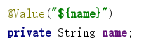 |  |
|                                            | 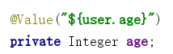 | 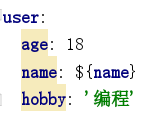 |
|                                            | 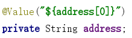 | 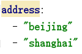 |
| Environment                                | 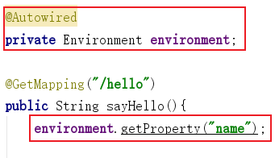 |  |
| @ConfigurationProperties    （重点，推荐） | 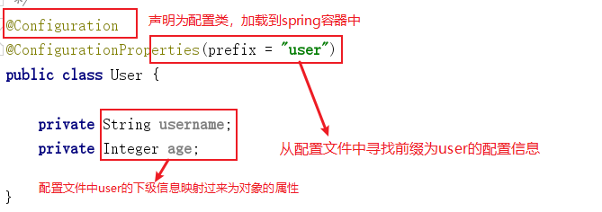 | 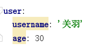 |
|                                            |                                                              |                                                              |

总结：

1，@Value("$name")  主要用来获取单个的值，比较零散，语法简单

2，Environment:  environment.getProperty("address[1]")  直接获取application配置文件对象

**3，@ConfigurationProperties  截取一部分生成对象，这是springboot自己用的最多的一种方式，推荐使用；**

补充：springboot配置注解解析器：（解决红色提示问题）

如果配置类上出现：请在pom文件中添加如下的依赖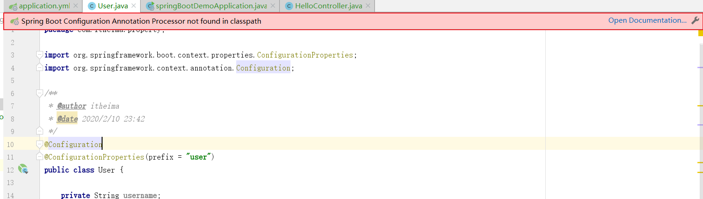

依赖如下：

~~~
<dependency>
	<groupId>org.springframework.boot</groupId>
	<artifactId>spring-boot-configuration-processor</artifactId>
	<optional>true</optional>
</dependency>
~~~

## 6.SpringBoot整合其他框架

业务需求：

实现一个通过浏览器传递id查询返回user信息的功能

数据库表准备：

~~~sql
CREATE TABLE `t_user` (
  `id` bigint(32) NOT NULL AUTO_INCREMENT,
  `name` varchar(20) NOT NULL DEFAULT '' COMMENT '姓名',
  `age` int(6) NOT NULL DEFAULT '0' COMMENT '年龄',
  PRIMARY KEY (`id`)
) ENGINE=InnoDB AUTO_INCREMENT=2 DEFAULT CHARSET=utf8;
~~~

#### 6.1.整合Mybatis

(1) 新建springboot项目

(2) 引入pom依赖

```xml
	<parent>
        <groupId>org.springframework.boot</groupId>
        <artifactId>spring-boot-starter-parent</artifactId>
        <version>2.1.7.RELEASE</version>
    </parent>
    <dependencies>
        <!-- web 起步依赖-->
        <dependency>
            <groupId>org.springframework.boot</groupId>
            <artifactId>spring-boot-starter-web</artifactId>
        </dependency>
        <!-- mybatis 起步依赖-->
        <dependency>
            <groupId>org.mybatis.spring.boot</groupId>
            <artifactId>mybatis-spring-boot-starter</artifactId>
            <version>2.0.1</version>
        </dependency>
        <!-- mysql 依赖-->
        <dependency>
            <groupId>mysql</groupId>
            <artifactId>mysql-connector-java</artifactId>
        </dependency>
        <!-- lombok getter setter-->
        <dependency>
            <groupId>org.projectlombok</groupId>
            <artifactId>lombok</artifactId>
        </dependency>
    </dependencies>
```

(3) 编辑启动类,程序的入口

```java
@SpringBootApplication
public class MybatisApplication {

    public static void main(String[] args) {
        SpringApplication.run(MybatisApplication.class, args);
    }
}
```

(4) 编辑自定义配置文件application.yml，因为数据库的地址和账号密码springboot猜不到

```yml
spring:
  datasource:
    driver-class-name: com.mysql.jdbc.Driver
    url: jdbc:mysql://192.168.176.109:3306/springboot?useUnicode=true&characterEncoding=UTF8&useSSL=false&allowMultiQueries=true&serverTimezone=Asia/Shanghai
    username: root
    password: 123456
```

(5) 编辑实体类,和数据库表的字段一一对应

```java
@Data
public class User {

    private Long id;
    private String name;
    private Integer age;

}
```

(6) 编辑mapper（有人称之为dao，一样一样的), 在mapper中自定义方法

~~~java
public interface UserMapper {

    //通过id获取User信息
    User findById(Long id);
}
~~~

此时，为了让spring扫描和加载到这个mapper，需要在启动类上添加

```java
@MapperScan("com.itheima.mapper")
```

所以，启动类变为了：

```java
@SpringBootApplication
@MapperScan("com.itheima.mapper")
public class MybatisApplication {

    public static void main(String[] args) {
        SpringApplication.run(MybatisApplication.class, args);
    }
}
```

(7) 在resources下 创建mappers文件夹，然后在mappers文件下创建UserMapper.xml文件

~~~xml
<?xml version="1.0" encoding="UTF-8" ?>
<!DOCTYPE mapper
        PUBLIC "-//mybatis.org//DTD Mapper 3.0//EN"
        "http://mybatis.org/dtd/mybatis-3-mapper.dtd">
<mapper namespace="com.itheima.mapper.UserMapper">

    <resultMap id="userResultMap" type="com.itheima.domain.User">
        <id column="id" property="id"></id>
        <result column="name" property="name"></result>
        <result column="age" property="age"></result>

    </resultMap>

    <select id="findById" resultMap="userResultMap">
        select * from t_user where id = #{id}
    </select>

</mapper>
~~~

为了让spring扫描到这个mybatis的xml文件，需要在application.xml文件中添加

```
mybatis:
  mapper-locations: classpath:mappers/**
```

所以，application.xml文件变为了

```yml
spring:
  datasource:
    driver-class-name: com.mysql.jdbc.Driver
    url: jdbc:mysql://192.168.176.109:3306/springboot?useUnicode=true&characterEncoding=UTF8&useSSL=false&allowMultiQueries=true&serverTimezone=Asia/Shanghai
    username: root
    password: 123456

mybatis:
  mapper-locations: classpath:mappers/**
```

(8) 编辑UserService业务接口，添加方法

```java
public interface UserService {

    //通过id获得User信息
    User findById(Long id);
}
```

(9) 编辑UserService接口的实现类UserServiceImpl, 通过添加@Service注解，将此类放入到spring容器中

```java
@Service
public class UserServiceImpl implements UserService {

    @Autowired
    private UserMapper userMapper;

    @Override
    public User findById(Long id) {
        return userMapper.findById(id);
    }
}
```

(10) 编辑UserController，通过添加@RestController注解，将此类放入到spring容器中，并且此controller中的所有方法返回的就都是Json格式字符串

```java
@RestController
public class UserController {

    @Autowired
    private UserService userService;

    @GetMapping("/user")
    public User findById(Long id) {
        return userService.findById(id);
    }
}
```

(11)  点击启动类的main方法按钮，启动程序，记得默认端口是8080，所以不要端口冲突（如果之前有8080端口的项目在运行，请换端口）

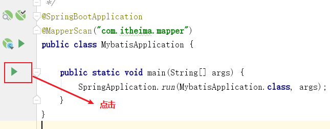

(12)浏览器访问,如图

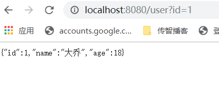

图形描述：

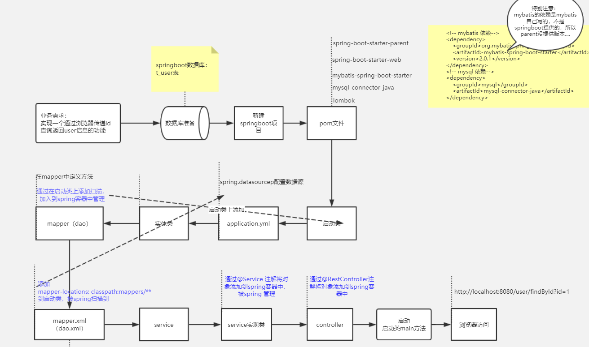

#### 6.2.整合Mybatis plus

(1) 新建springboot项目

(2) 引入pom依赖

```xml
<parent>
    <groupId>org.springframework.boot</groupId>
    <artifactId>spring-boot-starter-parent</artifactId>
    <version>2.1.7.RELEASE</version>
</parent>
<dependencies>
    <!-- web 起步依赖-->
    <dependency>
        <groupId>org.springframework.boot</groupId>
        <artifactId>spring-boot-starter-web</artifactId>
    </dependency>
    <!-- mybatis plus 起步依赖-->
    <dependency>
        <groupId>com.baomidou</groupId>
        <artifactId>mybatis-plus-boot-starter</artifactId>
        <version>2.3</version>
    </dependency>
    <!-- mysql 依赖-->
    <dependency>
        <groupId>mysql</groupId>
        <artifactId>mysql-connector-java</artifactId>
    </dependency>
    <!-- lombok getter setter-->
    <dependency>
        <groupId>org.projectlombok</groupId>
        <artifactId>lombok</artifactId>
    </dependency>
</dependencies>
```

(3) 编辑启动类,程序的入口

```java
@SpringBootApplication
public class MybatisApplication {

    public static void main(String[] args) {
        SpringApplication.run(MybatisApplication.class, args);
    }
}
```

(4) 编辑自定义配置文件application.yml，因为数据库的地址和账号密码springboot猜不到

~~~yml
spring:
  datasource:
    driver-class-name: com.mysql.jdbc.Driver
    url: jdbc:mysql://192.168.176.109:3306/springboot?useUnicode=true&characterEncoding=UTF8&useSSL=false&allowMultiQueries=true&serverTimezone=Asia/Shanghai
    username: root
    password: 123456
~~~

(5) 编辑实体类,和数据库表的字段一一对应, 添加@TableName("t_user") 注解，t_user是表名，表示此类和数据库表的对应

```java
@Data
@TableName("t_user")
public class User {

    private Long id;
    private String name;
    private Integer age;

}
```

(6) 编辑mapper（有人称之为dao，一样一样的)，继承BaseMapper<User>，<User>是泛型，就是第五步创建的实体类,这样UserMapper就有默认的增删改查方法了

```java
public interface UserMapper extends BaseMapper<User> {

}
```

此时，为了让spring扫描和加载到这个mapper，需要在启动类上添加

```java
@MapperScan("com.itheima.mapper")
```

所以，启动类变为了：

```java
@SpringBootApplication
@MapperScan("com.itheima.mapper")
public class MybatisApplication {

    public static void main(String[] args) {
        SpringApplication.run(MybatisApplication.class, args);
    }
}
```

(7) 编辑UserService业务接口，添加方法

```java
public interface UserService {

    //通过id获得User信息
    User findById(Long id);
}
```

(8) 编辑UserService接口的实现类UserServiceImpl, 通过添加@Service注解，将此类放入到spring容器中，注意：userMapper.selectById 是mapper内置的方法......

```java
@Service
public class UserServiceImpl implements UserService {

    @Autowired
    private UserMapper userMapper;

    @Override
    public User findById(Long id) {
        return userMapper.selectById(id);
    }
}
```

如图：

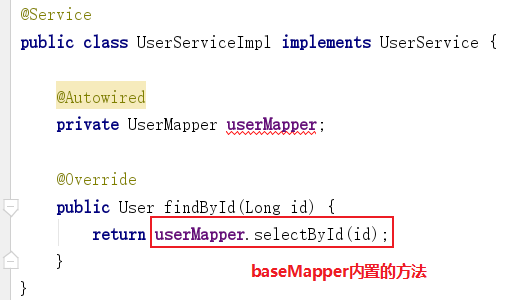

(9) 编辑UserController，通过添加@RestController注解，将此类放入到spring容器中，并且此controller中的所有方法返回的就都是Json格式字符串

```java
@RestController
public class UserController {

    @Autowired
    private UserService userService;

    @GetMapping("/user")
    public User findById(Long id) {
        return userService.findById(id);
    }
}
```

(11)  点击启动类的main方法按钮，启动程序，记得默认端口是8080，所以不要端口冲突（如果之前有8080端口的项目在运行，请换端口）

(11)  点击启动类的main方法按钮，启动程序，记得默认端口是8080，所以不要端口冲突（如果之前有8080端口的项目在运行，请换端口）


(12)浏览器访问,如图


(13) 如果想打印sql语句，可以在application.yml中添加如下：其中com.itheima.mapper代表你想打印日志的包，此包下的所有内容，debug级别的日志都会打印

```yml
logging:
  level:
    com.itheima.mapper: debug
```

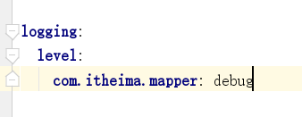

(14)再次访问controller接口，控制台就会打印如下：

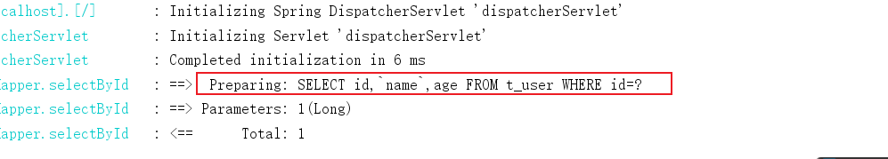

图形描述：

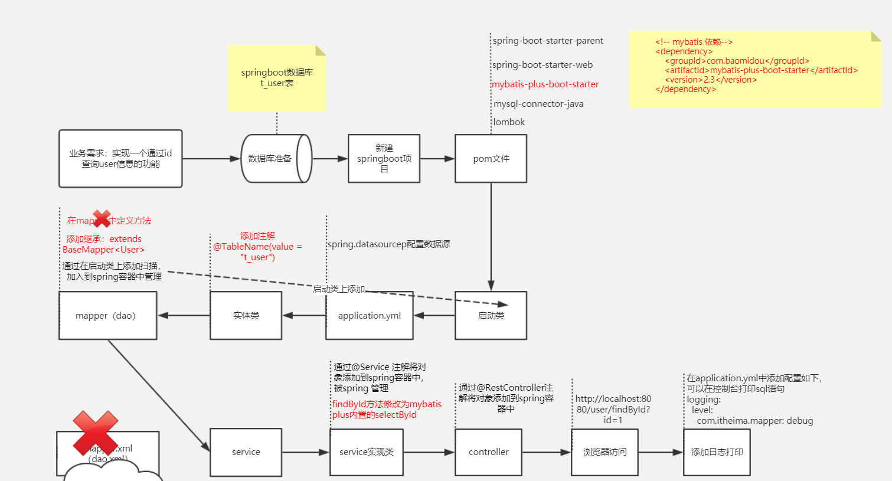

#### 6.3.整合 JUnit

文字描述：

(1) 在pom.xml文件中添加test单元测试的依赖

~~~xml
   <!--Junit单元测试的起步依赖-->
        <dependency>
            <groupId>org.springframework.boot</groupId>
            <artifactId>spring-boot-starter-test</artifactId>
        </dependency>
~~~

(2) 在test的java包下编辑和项目引导类一样的包地址,在这个包下创建测试类，如下图：

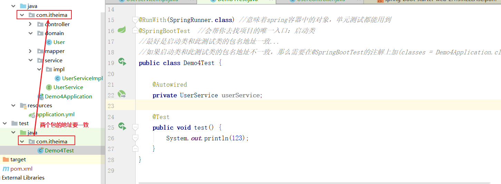

(3)  编辑代码，添加如下的两个注解：

**1) @RunWith(SpringRunner.class)**  

//意味着spring容器中的对象，单元测试都能用到

**2)@SpringBootTest**

//会帮你去找项目的唯一入口：启动类   	

ps:最好是启动类和此测试类的包名地址一致...如果启动类和此测试类的包名地址不一致，那么需要在@SpringBootTest的注解上加(classes = Demo4Application.class),Demo4Application就为引导类的类名

如图：

~~~java
@RunWith(SpringRunner.class)
@SpringBootTest  
public class Demo4Test {

    @Test
    public void test() {
        System.out.println(123);
    }
}
~~~

(3) 在需要测试的方法上点击如图：


(4) 查看测试结果

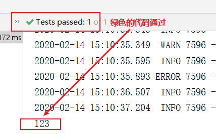

#### 6.4.整合日志

在配置文件application.yml中添加如图信息即可，然后观察控制台打印内容

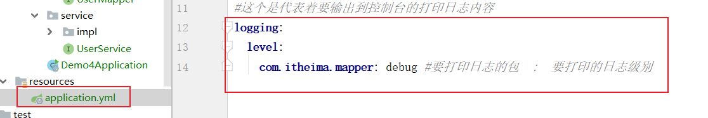

sql日志打印信息如下：

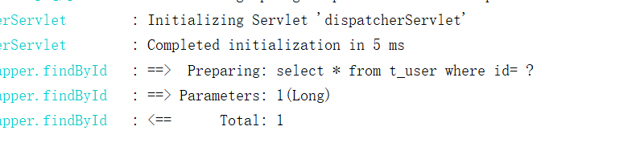